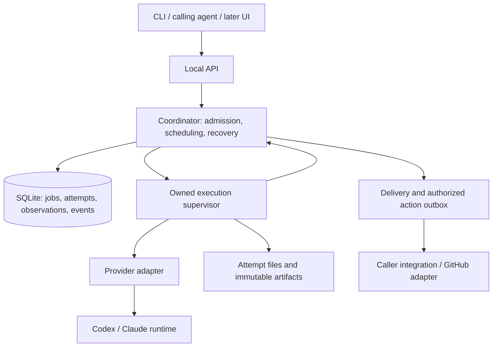

# Rebuilding Subfleet from scratch

Design proposal · 5 September 2026

## Recommendation

I would rebuild Subfleet as a **local service that owns delegated work from submission through a verified result**. Its central object would be a job that can survive several execution attempts, account changes, caller restarts, and delayed delivery.

The product promise would be:

> Give Subfleet a bounded assignment and its constraints. It finds an eligible execution resource, preserves the work, and returns a result whose provenance and status you can inspect.

The most valuable existing work is the operational knowledge: subscription windows are uncertain, limits can apply to a model within an account, authentication has an owner, requested models can differ from served models, desktop sessions disappear, and approval becomes invalid when the reviewed revision changes. I would carry that knowledge forward as explicit contracts and acceptance tests.

My default implementation would be **Go, SQLite, one local coordinator, and small provider adapters around the vendor runtimes**. Python remains a reasonable implementation choice if the initial prototype shows that Go adds more integration work than it removes. The architectural decisions below matter much more than that language preference.

The first release would support reliable execution on one machine, using the accounts and subscriptions the operator has configured. It would provide a complete CLI installation and a small interface for calling agents. Desktop integration, richer workflows, and remote workers would build on that interface.

This is a clean-sheet design with an incremental replacement strategy. I would keep the working installation available while proving the replacement on separate resources.

## Basis and limits of this assessment

I inspected the installed source at `/Users/maxghenis/chief-of-staff/subfleet`, reached by `/Users/maxghenis/bin/subfleet`, and the public checkout at `/Users/maxghenis/subfleet-public`. The installed repository HEAD was `57a851a0d08ea2e329c0593fd2d75ba4280c2d82`; the public checkout was on `detached-notices` at `98ecd11`. The broader installed repository was dirty; no repository files were changed.

Two independent code audits covered lifecycle and public packaging. A separate design critique challenged the proposed replacement. I also checked current primary documentation for provider interfaces and SQLite. This is a source-based architecture assessment, not a measured production reliability study. I did not run the existing test suite, benchmark dispatch latency, or inspect live task prompts, outputs, or credential stores.

The planning assumptions are a trusted personal workstation, several provider accounts, multiple calling agents, and concurrent delegated work. Multi-user hosting, hostile tenants, and a multi-machine scheduler would require additional design. Milestone dates below are estimates, not measured implementation times.

## What the existing implementation tells me

| Finding | Why it matters to the rebuild |
|---|---|
| Attached Claude dispatch can promote the semantic model in Python, while detached dispatch hands lane rotation to the shell runner. | Attaching should only change how someone observes a job. Retry and routing policy need one owner. See [router](/Users/maxghenis/chief-of-staff/subfleet/subfleet/delegate.py:1231) and [runner](/Users/maxghenis/chief-of-staff/subfleet/bin/subfleet-claude:864). |
| A run records a mutable lane/session and final return code; retries can replace session identity and truncate output files. | Represent attempts and their artifacts individually. See [run finalization](/Users/maxghenis/chief-of-staff/subfleet/subfleet/run_ledger.py:542) and [Claude retry setup](/Users/maxghenis/chief-of-staff/subfleet/bin/subfleet-claude:757). |
| Ledger finalization holds a global lock while copying artifacts, inspecting Git state, and pruning. | Keep database transactions short and move artifact collection and retention outside them. This is observed lock scope; its production latency impact has not been measured. See [finalization](/Users/maxghenis/chief-of-staff/subfleet/subfleet/run_ledger.py:515). |
| The output collision guard checks existing live runs before launch. | Reserve output ownership atomically with attempt admission. Concurrent callers can otherwise pass a separate check before either records ownership. See [collision detection](/Users/maxghenis/chief-of-staff/subfleet/subfleet/run_ledger.py:647). |
| Notifications can be sent before their durable notice is recorded; a successful socket write is treated as delivery. | Create a durable outbox with distinct sent and acknowledged states. See [completion delivery](/Users/maxghenis/chief-of-staff/subfleet/subfleet/notify.py:632). |
| Revision-bound gates already contain careful approval, attestation, and action reconciliation logic. | Preserve these semantics and share the lifecycle infrastructure underneath them. See [approval fingerprints](/Users/maxghenis/chief-of-staff/subfleet/subfleet/consensus.py:268) and [merge action](/Users/maxghenis/chief-of-staff/subfleet/subfleet/consensus.py:793). |
| The public wheel packages Python, while core dispatch commands expect sibling scripts from a checkout. | Make the installed release the product tested in CI. See [packaging](/Users/maxghenis/subfleet-public/pyproject.toml:26) and [runner lookup](/Users/maxghenis/subfleet-public/subfleet/cli.py:886). |
| The public and installed trees differ substantially. Public has generic configuration abstractions; installed has newer gates, continuity, routing, and reset policy. | Consolidate into one implementation with operator profiles. Porting fixes between two products should end. |
| Model mappings and retired aliases are hardcoded; write-enabled dispatch adds commit and PROGRESS.md instructions. | Separate execution machinery, routing policy, and workflow templates. See [routing constants and preambles](/Users/maxghenis/chief-of-staff/subfleet/subfleet/delegate.py:59). |

These findings justify changing ownership and state boundaries. File size alone would not justify a rewrite.

## Product scope

The first version should make six everyday operations dependable:

1. Submit a lookup, review, sweep, build, or writing assignment with explicit constraints.
2. Leave the calling session and return later without changing execution behavior.
3. See which account and model are executing, what is blocked, and what evidence supports that status.
4. Recover from quota exhaustion or a process interruption within the assignment's retry and quality policy.
5. Retrieve a durable result, its failed attempts, and any changes or validation artifacts.
6. Obtain independent approval of an exact revision and, when already authorized, carry out the associated action.

Preserve `--task` and `--tier` as the normal routing interface. Keep explicit model and account pins for cases where identity matters. Make the cost regime explicit: a subscription job must not quietly become a metered API job.

For the first execution milestone, postpone automatic desktop mirroring, session resurrection, roll calls, browser automation, a GUI, arbitrary workflow graphs, a plugin marketplace, and remote workers. Existing integrations can continue against their existing resources during migration. Their replacements must consume the same job and event API.

I would also defer automatic subscription-window activation and automatic reset-credit consumption until ordinary scheduling is reliable. They change capacity state and deserve their own observable action policy.

## Architecture and implementation choices



These are module boundaries. They do not imply separate network services. Initially there is one coordinator process and supervised execution processes launched from the same installed package.

| Decision | Choice and reason |
|---|---|
| Runtime | Go for the coordinator, CLI, and supervisors: one distributable program, typed boundaries, and a straightforward process-oriented implementation. Keep the first adapter in-process; introduce a language bridge only for a demonstrated vendor SDK requirement. |
| Database | SQLite on a local disk, with schema migrations, foreign keys, WAL, and short transactions. Store authoritative state, reservations, and pending deliveries together. |
| Artifacts | Private local files, with content hashes and database references. Large provider streams never sit in hot database rows. |
| Client transport | Versioned JSON over a Unix-domain socket. One request/response format and a resumable event stream. Avoid TCP exposure in the initial release. |
| Execution | Vendor runtimes retain their tools, agent loop, and native context management. Subfleet owns admission, accounting, retries between attempts, and result acceptance. |
| Configuration | Versioned TOML plus explicit profiles. Provider handles and secret references are configuration; credential values are not. |
| UI | CLI first, then calling-agent/MCP tools. A desktop or web client comes after the execution API stabilizes. |

Go is my preference for a fresh implementation, not an explanation for today's issues. Typed Python with a packaged entry point, SQLite, and the same ownership rules could deliver this design. I would give the Go choice a two-day spike: install the artifact, launch a fake provider, stream events, detach, cancel, restart the coordinator, and reconnect. If this exposes expensive platform friction, choose Python before building the domain layer.

SQLite WAL supports concurrent readers and a single writer, and its shared-memory mechanism requires processes on the same host. That fits the proposed coordinator. Use `synchronous=FULL` for the acknowledged-work durability contract, bounded write transactions, managed checkpoints, and a real backup operation. Keep the database off network filesystems. See [SQLite WAL documentation](https://www.sqlite.org/wal.html).

I would use ordinary current-state tables plus an append-only event record written in the same transactions. Operational restart reads those tables and reconciles executions. It does not rerun historical model calls or arbitrary old orchestration code. Version the events for audit and offline policy simulation; do not make a full event-sourcing framework a prerequisite.

Temporal deserves reconsideration if Subfleet becomes a shared service with multi-host execution and long-lived workflows. Its durable workflow model is relevant, but adopting it now adds another operational system while leaving provider processes, artifact custody, and external-effect reconciliation to solve. See [Temporal workflow execution](https://docs.temporal.io/workflow-execution).

## A small domain model with explicit ownership

| Entity | Meaning and essential fields |
|---|---|
| Job | The caller's assignment: immutable input manifest, task/tier, allowed model profiles, deadline, retry budget, workspace policy, acceptance policy, caller identity, parent job, status. |
| Attempt | One execution: job ID, attempt number, provider/account/runtime handle, requested and observed model, process identity, lease generation, timestamps, typed outcome, provider-session link. |
| Provider session | A native conversation owned by a provider runtime and authentication home. Continuation references this identity; it is not the job ID. |
| Account and runtime handle | Provider account identity and the host-local mechanism used to execute with it. Multiple handles for one account share capacity constraints. |
| Capacity observation | A timestamped report about a named quota bucket, its scope, units, utilization or bounds, reset, source, and confidence. |
| Reservation | Admission claims for account concurrency, workspace writes, output export, and any conservatively estimated capacity. |
| Artifact | A durable file or bundle with a hash, type, producing attempt, size, and retention references. |
| Delivery | A pending notice to a caller or integration, with stable event ID and transport-specific acknowledgement state. |
| Gate and action | Revision-bound approvals and an explicitly authorized external operation with its own execution and reconciliation state. |

Implement these as a few modules and tables; do not turn every noun into a framework.

Keep a distinct logical account ID even when the UI calls it a lane. A directory is an execution handle, not proof of an independent subscription. Normalize duplicate account bindings so neither available capacity nor reset credits are counted twice. Authentication homes and provider sessions remain host-bound.

Every job input manifest should record the actual prompt, referenced input hashes, relevant repository revision, resolved workflow template, permission profile, routing-policy hash, and adapter/runtime versions. Required mutable inputs must be captured as bytes or immutable artifact references before acceptance; a path and its old hash alone do not preserve the input. Store user intent separately from the expanded prompt.

A native resume is a new attempt linked to an existing provider session. A cross-provider handoff creates a new session from an explicit continuation package: objective, completed work, remaining work, relevant artifacts, validation evidence, and unresolved decisions. Record that reconstruction in provenance. It does not recreate hidden model state.

## Lifecycle, recovery, and cancellation

The job states would be `queued`, `running`, `waiting`, `succeeded`, `failed`, and `cancelled`. A waiting job has a reason and, where known, a next check time: capacity, dependency, user input, approval, or uncertain execution. This avoids inventing a new top-level state for every subsystem.

Attempts need more detailed states:

```text
prepared → starting → running → collecting → succeeded
                      │             └─────→ failed
                      ├───────────────────→ interrupted
                      └───────────────────→ indeterminate
```

A failed attempt can leave the job waiting for another attempt. An indeterminate attempt cannot be silently treated as safely retryable. Process outcome, result validation, gate approval, and notification delivery are separate facts.

The invariants I would implement first:

- Returning an accepted job ID means its input and queue record are durable.
- A provider launch must have a previously recorded attempt identity.
- Only the coordinator decides whether to retry, select another account, or change the model.
- A job has one accepted result reference; every attempt keeps its own outputs.
- Changing attach/wait mode does not change scheduling or retry semantics.
- A quiet transcript is not evidence that execution failed.
- Losing a lease is not evidence that the old process stopped.
- A result or action is never accepted from an obsolete execution generation.
- Unknown outcomes remain visible until reconciled.

Submission uses a caller-supplied idempotency key when available. Repeating the key with the same input returns the same job; repeating it with different input returns a conflict. Two jobs with identical prompts are still distinct unless the caller explicitly requests deduplication.

Admission takes one short transaction: choose an eligible resource from recorded observations, claim the applicable concurrency/workspace/export reservations, and create the attempt with a new generation. A commit establishes permission to prepare execution. The actual provider launch happens outside the transaction.

Each execution supervisor gets a durable attempt manifest and launches in an independent process session. It registers its process incarnation and confirms authorization before starting the provider. Control messages carry attempt identity and generation. Record host boot identity, process ID, process start identity, owned process group, provider-session ID when available, and a reconnectable control endpoint.

There is still a crash window around process creation. Persisting launch intent does not make OS spawning transactional. If a supervisor dies after launching but before recording enough identity, recovery must inspect its owned execution boundary. When it cannot establish whether work is still executing, mark the attempt indeterminate and quarantine its workspace. Retain the account concurrency claim while that execution may still consume capacity. Do not launch another writer there.

During a coordinator outage, an already authorized supervisor may finish its existing attempt and spool its events and result locally. It may not choose another account, start a replacement attempt, or dispatch a new control-plane action. The existing vendor process may still perform network operations within its granted powers; preventing those requires actual credential or network restrictions. On reconnection, the coordinator deduplicates sequence-numbered events and reconciles the result.

Cap the spool size and reserve space for terminal metadata. Optional telemetry can be dropped with an explicit loss marker; required result data cannot be silently truncated. If required output cannot be preserved, interrupt and then terminate the execution where possible, retain existing artifacts, and record collection failure or uncertainty. An incomplete terminal manifest must trigger reconciliation after reconnect, including when disk exhaustion prevented writing the failure record.

On restart, reconcile prepared and starting attempts, reconnect to live supervisors, collect durable outcomes, and quarantine ambiguous executions. Never infer ownership from PID alone. A new coordinator process acquires an OS-level singleton host lock before changing state and binds the local API endpoint to that owner. SQLite write serialization alone does not prevent two schedulers from launching work. Reattachment validates attempt generation, supervisor incarnation, and process identity.

Cancellation is a durable request. Stop new admission for the job and its owned descendants, ask the vendor runtime to interrupt where supported, then terminate the owned process tree after a bounded grace period. Confirm termination before releasing a write reservation. If confirmation is unavailable, expose cancellation as unresolved and retain the quarantine. An old PID that has been reused must never receive a signal.

Serialize cancellation and result acceptance in transactions. If cancellation commits first, a later successful attempt retains its artifacts but cannot change the job to succeeded. If result acceptance commits first, cancellation reports that the job already finished. Cancel unclaimed action intents; reconcile actions already dispatched because cancellation cannot undo remote effects.

Quarantine needs a usable resolution path: inspect evidence, reconnect, terminate-and-confirm, or explicitly resolve with operator authorization. Record the actor, evidence, and residual uncertainty for every manual resolution. Elapsed time alone never releases an uncertain ownership claim.

Parent cancellation should propagate to child jobs by default. An explicitly independent child can outlive its parent. Aggregate descendant concurrency and retry budgets so an agent cannot accidentally create an unbounded tree of nested dispatches. Notification and continuation must address a caller/session endpoint, never an arbitrary headless lane.

## Workspaces, artifacts, and the limit of fencing

Give every attempt a unique private output directory. Preserve failed outputs and errors. Write finalized artifacts to temporary files, synchronize file contents, rename atomically on the same filesystem, synchronize the containing directory, then record their hashes and references. Verify the persistence sequence on each supported platform. A crash before the database reference leaves a collectible orphan file; a referenced artifact must already be durable.

The caller's `--output` path is an export destination for the accepted artifact. It is not a shared file repeatedly truncated by retrying workers. Reserve that destination at submission/admission and publish with an atomic rename. If export fails, keep the successful job result and expose the export failure separately.

For builds, default to a fresh worktree from a captured upstream revision. Support a deliberate snapshot of a dirty working tree, and an explicit in-place mode for tasks that need it. Read-only reviews consume an immutable revision or prepared input bundle. Parallel jobs writing the same directory should require an explicit cooperative policy.

Preserve salvage with a temporary Git index and `commit-tree` or equivalent artifact capture, leaving the user's HEAD and real index intact. Successful completion must not depend on adding PROGRESS.md or making commits unless the selected workflow requests that behavior.

**Fencing protects Subfleet's accepted state and publication path. It does not revoke a running CLI's filesystem or network powers.** A stale process with broad credentials can still write files or call an external service. Consequently:

- Never reuse an uncertain attempt's write workspace.
- Require confirmed termination before retrying in place.
- Keep controlled publication behind the action executor.
- Do not provide build/review workers with publication credentials when strict action control is required.
- Use an OS-enforced execution profile for stronger guarantees; prompts and Git worktrees alone are not isolation.

The initial personal-workstation mode can explicitly trust cooperative local processes. It must not advertise hostile-agent isolation. A same-user agent with unrestricted filesystem access can also modify a local database; stronger separation requires an OS identity or sandbox boundary.

Result acceptance should separately evaluate provider completion, artifact existence and integrity, output schema, required checks, and model evidence. A nonempty answer and exit code zero establish less than “the assignment is correct.” Let the job name executable checks or a review requirement, and display which checks actually ran.

## Routing and quota scheduling

Start with deterministic, explainable rules. A learning-based scheduler should wait until Subfleet has trustworthy attempt outcomes and a representative evaluation set.

Separate routing into four steps:

1. Resolve the task policy into an ordered set of eligible model profiles.
2. Filter execution resources by permissions, authentication health, model support, applicable limits, cost regime, and exclusions.
3. Rank eligible resources according to the operator's capacity policy.
4. Atomically reserve the winner and record both the choice and relevant rejection reasons.

“Harder model” is not a universal numeric ordering. A prose or adjudication profile may require a particular model family; a coding profile may allow a different set. Represent quality floors as task-specific eligibility and promotion rules. A provider outage must not silently override those constraints.

Resolve exact model IDs strictly. If an exact ID is unavailable, wait or fail with a specific reason. Friendly aliases can map through a versioned policy, but preserve requested alias, resolved ID, and policy hash. Compatibility translation of an old alias must be visible in both human and machine output.

A model profile also resolves reasoning effort, context requirements, required tools, output capabilities, and the permitted cost regime. These settings affect both quality and capacity consumption. Record them per attempt; model identity alone is not a complete execution specification.

The current task/tier grid belongs in an operator profile. The installed router has already moved beyond older Sol mappings, illustrating why standing instructions, model catalogs, and runtime defaults need reconciliation. Treat catalog discovery as evidence of availability, not authority to rewrite an active job's requirements.

For each quota bucket, store provider/account, bucket ID, any model scope, time window, units, value or interval, reset timestamp, observed timestamp, source, and confidence. Support multiple overlapping buckets; a job must satisfy every applicable constraint. Do not assume all future plans consist of exactly five-hour and weekly windows.

Unknown, stale, observed, and estimated values remain distinct. A failed quota probe is not proof of failed inference authentication. Historical token totals are useful estimates; they are not a vendor promise about remaining messages. A model-specific hard limit should not unnecessarily disable other eligible models on that account.

Preserve the practical existing policies as configurable defaults:

- Exclude invalid authentication, missing credentials, explicit cooldowns, and incompatible runtimes.
- Protect the interactive account according to the operator's policy.
- Prefer expiring eligible subscription capacity when doing so respects admission limits.
- Drain capacity stranded behind a particular model's limit with other eligible tasks.
- Permit a conservative single in-flight job on an account with unknown headroom when policy allows.
- Promote only through the permitted task-specific sequence.

Make the single-job rule for an unknown account an actual transactionally enforced reservation. An observed in-flight count is insufficient for two simultaneous callers.

Concurrency reservations are enforceable local counts. Capacity reservations are estimates and should carry their uncertainty. Start conservatively and learn usage distributions by task/model only after gathering enough evidence. Preserve reported provider windows without turning estimated reservations into fabricated utilization.

Scheduling also needs fairness. Reserve an operator-configurable allowance for interactive work, bound each parent/project's concurrency, and age queued jobs so a stream of urgent small tasks cannot permanently starve a large one. Keep batch work behind interactive jobs by default, with explicit deadline overrides.

Every job should answer “Why this model/account?” and “Why am I waiting?” from persisted decision data. Example: “Preferred model has no eligible account until approximately 14:20; promotion to the next approved model is allowed, but its concurrency limit is currently occupied.”

Subscription capacity and dollars should be reported separately. Do not sum percentages from unrelated provider buckets into a purported token balance. Cross-provider comparisons should use practical outcomes such as accepted jobs, queue time, retries, and measured cost where available.

## Provider adapters and authentication

The adapter interface should expose a small, explicit capability set:

```text
describe_capabilities(runtime_version, account_handle)
observe_capacity(account_handle)
prepare(attempt_spec)
start(prepared_attempt)
observe(execution_handle, after_sequence)
interrupt(execution_handle)
terminate(execution_handle)
resume(provider_session, continuation)
collect(execution_handle)
```

Some capabilities will be unavailable. Return that fact instead of emulating them through an undocumented path in the scheduler. Adapter preparation validates the runtime version, supported model, authentication mode, and permission profile before capacity is spent.

Each adapter emits normalized outcomes: capacity exhausted with scope/reset if known; authentication invalid; runtime incompatible; transient transport failure; provider rejection; execution interrupted; malformed output; model evidence missing or mismatched; uncertain external effect. Keep raw provider events as diagnostic artifacts. Unknown event fields should be preserved without breaking parsing; missing required semantics should produce an explicit adapter failure.

Adapters must not implement another layer of account rotation or job retries. A vendor runtime may have its own internal request retries; record their visibility limits. Subfleet's attempt budget covers launches and continuations it controls, and an overall deadline bounds the job.

**Codex.** Begin with structured `codex exec --json` execution where it meets the job contract. The documented stream includes native thread and turn events; saved CLI authentication is reused. This provides a supported basis for lifecycle observation without making stderr regexes the primary interface. See [non-interactive Codex](https://learn.chatgpt.com/docs/non-interactive-mode).

Evaluate a per-home App Server adapter early. Its documented interface includes stdio transport, account rate-limit reads and updates, and reset redemption with an idempotency key. Prefer those interfaces to maintaining independent backend endpoint clients where installed-version support is verified. Keep each runtime bound to its own authentication home. Probe capabilities and preserve an execution fallback when a richer interface is unavailable. See [Codex App Server](https://learn.chatgpt.com/docs/app-server).

**Claude.** Use the structured non-interactive interface with captured session identity and model evidence. Validate the actual installed runtime and authentication mode in the adapter contract tests. The documentation distinguishes subscription behavior from API-backed bare mode, so an apparently convenient startup flag can change the product's authentication assumptions. See [programmatic Claude Code](https://code.claude.com/docs/en/headless).

Treat public distribution and a hosted service as separate integration decisions. Anthropic's SDK documentation says third-party products need prior approval to offer claude.ai login/rate limits; API-key authentication is the documented alternative. That makes provider-supported authentication a release dependency. It does not justify silently switching a subscription assignment to paid API usage. See [Claude Agent SDK overview](https://code.claude.com/docs/en/agent-sdk/overview).

For both providers, credentials should remain in the vendor's supported store or the operator's configured secret service. On this machine, use `agent-secret` for agent-readable secrets. Pass references through Subfleet state; never persist token values in jobs, events, diagnostics, prompts, or command arguments. If a runtime requires a credential in its environment, confine it to the execution boundary and document the inherited-access limitation.

Authentication ownership is a prerequisite to concurrency. Subfleet should not switch a global login to launch different jobs, copy refresh tokens between homes, or independently rotate vendor-managed tokens. Where the runtime cannot safely coordinate concurrent authentication use, cap that handle to one execution until a supported shared runtime or locking mechanism is proven.

Model served evidence should state its source and coverage: provider-reported events, session metadata, or unavailable. An initial configured-model field alone may not prove the model used throughout a job. Sensitive review policies should require the needed evidence and reject missing or contradictory observations. Ordinary jobs may allow unknown attestation under an explicit acceptance policy, with that uncertainty visible in the result.

Keep protocol fixtures by vendor version, with a small optional live compatibility suite. Do not automatically upgrade a running fleet merely because a newer CLI exists. Test a candidate runtime on a canary account, record the resolved version, and promote deliberately.

## Approvals, external actions, and reset policy

Keep the existing main/peer agreement gate. It is one of Subfleet's most distinctive features and already has stronger revision discipline than a generic “agent says approved” workflow.

A gate should bind:

- The subject: repository and PR with exact head/base, or an immutable plan/artifact hash.
- The required reviewers and acceptable model evidence.
- The actual review attempt, input bundle, verdict artifact, and verdict schema.
- The main agent's approval of that same revision.
- The intended action and its parameters.
- The applicable authorization policy and any expiration/revalidation conditions.

Peer agreement is evidence within an already authorized workflow. It does not create permission to merge, publish, send a message, or spend money. The action executor checks both existing authorization and the gate's revision requirements.

Changes to the subject invalidate the relevant approval. Re-review creates another round linked to the new revision. A continuation must not relabel an old verdict as approval of fresh inputs.

Use the same jobs, attempts, artifacts, events, and outbox primitives for gates. Keep review-specific policy in a focused module. Reviewers get copied inputs and an isolated review workspace; record exclusions or different account/model requirements when the operator requests independence. Different model families can reduce some shared failure modes, but agreement is not a guarantee of correctness.

An external action has states such as `pending`, `executing`, `confirmed`, `failed`, and `unknown`. Persist its intent and stable operation key before calling the external system. A timeout after submission means unknown until reconciled. A transactional outbox guarantees durable intent; it does not make an arbitrary remote operation exactly once.

For GitHub merges, preserve matching the approved head in the request, fresh checks of head/base and required CI, and post-action confirmation. An expected-base preflight is not an atomic base lock. Branch protection or merge-queue policy must carry server-side conditions that a local preflight cannot guarantee. If the response is ambiguous, inspect the actual PR and merged revision before retrying.

Publishing credentials belong to this action boundary when enforcement is required. If a worker itself has unrestricted GitHub credentials, the gate is a cooperative workflow rule rather than a complete security boundary.

Reset-credit consumption should be another typed action, with separate policy from capacity observation. Carry forward the operator's authorized one-at-a-time preference, eligibility checks, candidate ordering, interval limit, and recorded outcome. Persist and reuse one idempotency key across uncertain retries of the same logical redemption. Re-read provider state after confirmation; do not invent a new weekly window merely because the confirmation arrived before the next quota observation.

Status, explain, and dry-run operations must never redeem a reset, send a message, or launch an inference task. Explicitly scheduled maintenance may do those things under its saved policy. Automatic paid API overflow or purchases are outside the initial release.

## Calling agents, notifications, and operator experience

Every front door should submit the same JobSpec and receive the same JobStatus. The CLI, an MCP tool, and a desktop client should not contain independent routing or recovery logic.

The following examples are a proposed interface, not commands implemented today:

```sh
subfleet run --task review --tier standard -C /path/to/repo -p review.md --wait
subfleet run --task build --tier hard -C /path/to/repo -p task.md --detach
subfleet wait JOB_ID --after CURSOR
subfleet runs show JOB_ID --json
subfleet cancel JOB_ID
subfleet explain JOB_ID
subfleet doctor
```

Internally, every run is durable and detached from the submitting client. `--wait` is a client behavior. For an interactive terminal, waiting can remain the ergonomic default; agent integrations should receive a job ID immediately. Expose the choice explicitly and keep compatibility defaults stable during migration.

Stdout should have a stable documented contract. Human progress goes to stderr; JSON mode emits versioned objects rather than interleaving prose. Document submission, waiting timeout, job failure, cancellation, and indeterminate execution separately. Preserve existing script exit codes through the compatibility layer before introducing any new mapping.

Offer only a small calling-agent surface initially: submit, inspect, wait for changed state, retrieve artifacts, and cancel. Add gate tools once their semantics are proven. Waits should use event cursors and bounded long polling, so agents do not repeatedly fetch full transcripts.

A completion transaction should atomically record the accepted result and enqueue its notice. A delivery worker resolves the current caller endpoint at send time. If the caller is absent, the event stays pending. When possible, the recipient acknowledges the event ID and deduplicates repeats.

Use precise transport states. “Sent to socket” is not “read by the agent.” A legacy integration without acknowledgements offers best-effort or at-least-once delivery with visible uncertainty. Delivery failures should not change a successful execution into a failed job.

Keep completion notices small: job ID, outcome, relevant uncertainty, artifact reference, and a short summary. Do not dump prompts or full results into another session. Do not wake headless execution lanes as if they were interactive callers.

Session mirrors and interrupted-session nudges belong in optional harness adapters. Preserve deliberate stop/retire intent. Reconnecting a caller should surface pending work without automatically manufacturing a new assignment. A vendor-specific transcript heuristic can be useful, but its result should not mutate core job truth.

The operator view should answer:

- What is running, queued, or waiting for me?
- Which accounts and model scopes are available, limited, or unknown?
- Why was this route chosen, and what could unblock the job?
- What happened in each attempt, and which result was accepted?
- Did the caller receive the completion, and did any authorized action actually finish?

Show active jobs regardless of a “last N completed jobs” filter. Keep “last output observed” separate from process health. Alert on meaningful transitions, completion, actionable failure, and needed user input; avoid repeated unchanged warnings.

Expose metrics for queue time, dispatch overhead, attempt outcomes by reason, orphan/indeterminate executions, model mismatches, deadline expirations, recovery time, notification delay, and account utilization evidence. Report measured API spending only where available. Keep optional telemetry off by default, and make local diagnostic exports redacted and reviewable.

Traycer or another desktop client should use this API. Logpile or another log viewer should consume event/artifact exports. Neither should become a second writer of scheduling state or a second implementation of provider parsing.

## Configuration, distribution, and maintenance

Ship one complete product from one repository. The operator's fleet becomes a private configuration profile, not a divergent implementation.

The release should contain the CLI, coordinator/worker entry points, provider adapter code, schemas, migrations, and optional service templates. Vendor executables remain explicit external dependencies with version checks. An install into a clean directory must be able to run a fake provider without access to the source checkout. During implementation, verify and pin dependency versions from their authoritative registries, record the resolved versions, and test the built release rather than assuming a source checkout represents installation.

Use one configuration root and one state root. Prefer explicit enrollment over scanning arbitrary homes at dispatch time. Discovery may suggest handles in `doctor` or enrollment, with duplicate identity detection. Preserve the useful existing distinction between a missing account list and an explicitly empty one.

Configuration precedence should be narrow and visible: built-in defaults, selected operator profile, permitted project settings, then explicit command arguments. Credentials, account ownership, and authority-expanding settings cannot be silently supplied by a repository file. Environment variables can choose roots and compatibility behavior, but should not become an undocumented alternate policy language.

Validate configuration before dispatch. Invalid configuration produces an error with its file and field, rather than an apparently empty fleet. Reloading a policy applies to new jobs; existing jobs retain their resolved contract unless the operator deliberately revises or cancels them. An emergency global pause or credential revocation can halt active work independently.

Preserve the expanded workflow template in the job manifest. Templates such as “make a draft PR” or “maintain a progress file” are explicit choices. The basic executor should not inject repository-writing instructions because it detected a broad keyword.

Install launchd integration for macOS and systemd integration for Linux only when requested by setup. Use a foreground coordinator mode for development and troubleshooting. Detect an incompatible running service and report its version instead of letting a newer CLI mutate an older database.

Upgrades should stop admission, drain or reconnect supported active supervisors, back up state through the database backup mechanism, migrate, run integrity checks, and resume. Prefer additive migrations during the first release series. A rollback after schema changes must follow a tested compatibility procedure; blindly restoring an older database can erase evidence of actions that already occurred.

Retention should be reference-aware. Never prune active attempts, pending deliveries, unresolved actions, gate evidence still in use, or artifacts needed by a continuation. Keep terminal metadata longer than bulky raw streams. Run garbage collection in a bounded maintenance pass outside admission transactions.

If disk pressure makes durable acceptance impossible, reject new work before launching a provider. Define a small protected reserve for recording execution outcomes, enforce spool limits, and surface a clear recovery action. A cheap dispatch that loses its result is expensive in operator attention and quota.

## Test strategy and release criteria

Treat the existing tests as an inventory of operational scenarios. Preserve behavior around immutable prompts, account identity, exact model policies, process-tree cancellation, caller-independent execution, salvage without changing the real index, notification targeting, and revision-bound gates. Do not mechanically translate assertions that mirror implementation details or are vacuous.

Build a fake provider executable with controllable event sequences and failures. It should emulate slow output, partial JSON, child processes, quota/auth failures, model mismatch, a final result followed by process failure, and a process that completes while the coordinator is unavailable. Most tests should use it with a fake clock and isolated HOME/config/state.

The most important suites are:

| Suite | Required examples |
|---|---|
| Admission | Concurrent submissions share a one-slot account; repeated idempotency keys; conflicting input under one key; duplicate account handles; output export conflicts. |
| Execution | Caller dies; provider spawns descendants; slow draining stdout/stderr; SIGINT versus SIGTERM behavior; explicit tool permission wait. |
| Crash recovery | Crash before and after admission, supervisor registration, provider launch, artifact rename, result commit, delivery send, and external action submission; disk-full and disconnected-spool exhaustion. |
| Cancellation | Cancellation survives restart; completion races obey transaction order; client retries remain idempotent; no new attempts after cancellation; reused PID is untouched; unknown termination retains quarantine. |
| Routing | Exact pins, task-specific eligibility, model-scoped limits, stale observations, unknown headroom, fairness, retry budget exhaustion, and interactive-account protection. |
| Result acceptance | Missing artifact, corrupt hash, schema failure, nonzero provider exit, absent/mismatched model evidence, check failure, and successful execution with failed export. |
| Gates/actions | Changed head or base, stale main approval, malformed peer verdict, unverified model, concurrent continuations, ambiguous merge/reset response, and replayed action key. |
| Integrations | Missing caller, restarted endpoint, duplicate notice, no acknowledgement, deliberate stop marker, and headless-lane exclusion. |
| Installation/migration | Clean release install, vendor absent/too old, invalid config, old schema import, restart during upgrade, and account ownership rollback. |

Process-tree handling needs real OS-level tests on supported platforms. Go's command cancellation APIs do not remove the need to implement and verify descendant-process handling; see [Go subprocess documentation](https://pkg.go.dev/os/exec).

Use property/state-machine tests for invariants such as one accepted result, no automatic retry from an unresolved write attempt, and every published action having the required revision-bound authorization. Replay recorded routing observations into old and new policies without executing provider work. Label intentional policy changes instead of forcing byte-for-byte parity with every historical bug.

Live provider calls belong in an opt-in compatibility suite on designated accounts. They should validate authentication ownership, stream parsing, resume, cancellation, and model evidence with small tasks. Do not spend production quota on a full live integration matrix for every source change.

Initial release targets, to be measured on a named local test machine:

- Zero lost acknowledged jobs in the controlled crash suite.
- Zero duplicate accepted results or stale-generation publications in that suite.
- Zero silent violation of exact model pins or task eligibility.
- Zero unconfirmed workspace reuse after uncertain termination.
- Local cached status p95 below 100 ms; acceptance p95 below 250 ms, excluding provider probes and large input snapshots.
- Reconcile ordinary recoverable coordinator restarts within 30 seconds.
- Complete 100 representative canary jobs plus a seven-day operational soak without an unresolved data-loss, ownership, or duplicate-action defect.

These are proposed release gates, not claims about present performance. A passing fake-provider suite cannot prove arbitrary external effects are exactly once or all real providers behave correctly.

## Migration without losing the working fleet

First capture the current behavioral contract and a redacted inventory of configuration and identity relationships. Keep credentials in place. Do not let the replacement opportunistically merge several mutable state directories on startup.

The migration unit must be **a provider account and its execution handles**, not merely a named lane or model. Two apparently separate pools can still race over the same account's tokens and quotas.

1. **Inventory and freeze interfaces.** Record installed entry points, script callers, account/home bindings, active jobs, native sessions, gate revisions, and optional integrations. Add a compatibility manifest for flags, exit codes, environment aliases, and output formats.
2. **Import completed history read-only.** Preserve legacy IDs, provenance, artifact references, and source format. Do not invent attempt records the legacy ledger cannot establish. Mark imported metadata quality.
3. **Shadow routing.** Feed recorded observations to the replacement without launching providers, refreshing credentials, redeeming resets, or sending notices. Compare decisions and explain every meaningful difference.
4. **Assign a canary account exclusively to the new runtime.** Drain its legacy work and disable every old dispatcher, watchdog mutation, keepalive, and reset action that can use it. Confirm unique account identity across homes before transfer.
5. **Move read-only jobs first.** Check acceptance, cancellation, retry policy, artifacts, and delivery. Expand to isolated build work after crash recovery and workspace protection pass.
6. **Move gates and actions separately.** Let active legacy gates finish by default. Import an active gate only if its subject fingerprint, approvals, peer evidence, and action state can be verified. Never rebuild approval from a summary.
7. **Transfer additional accounts in batches.** Record ownership transfer and keep a rollback procedure per account. The old and new runtimes must never independently admit work for the same transferred account.
8. **Replace the front door.** Point the ordinary CLI at the new runtime once compatibility and canary criteria pass. Keep explicit access to legacy history and draining runs.
9. **Retire compatibility integrations deliberately.** Remove the old launchd jobs and code paths only after their behavior has migrated or the operator has chosen to stop using them.

Rollback stops new admission, drains or quarantines active new attempts, confirms resource ownership, and transfers selected accounts back. Restore execution ownership separately from historical data. Results, review evidence, and remote actions created during the canary remain recorded; rollback must not erase them.

Keep a bounded compatibility period for CARPOOL_* and DELEGATE_* inputs and legacy commands. Translate them through one layer with visible diagnostics. Do not maintain two full routing implementations indefinitely.

## Delivery plan

I would budget roughly **8–12 engineer-weeks** for a trustworthy personal-workstation replacement with both providers, continuity, gates, migration, and release packaging. This is a planning estimate assuming one primary implementer, bounded parallel assistance, and reuse of existing behavioral knowledge. Provider integration and real process recovery are the largest uncertainties. Elapsed time also includes the canary soak.

The useful execution core should arrive much earlier than full migration. Do not wait for a GUI or every legacy maintenance command.

| Milestone | Effort estimate | Concrete deliverable | Exit evidence |
|---|---:|---|---|
| 0. Contracts and language spike | 2–3 days | Job/attempt schema, failure invariants, compatibility inventory, installable fake-provider prototype. | Fresh install can launch, stream, cancel, restart, and retrieve an execution result; choose Go or Python decisively. |
| 1. Durable single-provider slice | 5–7 days | Coordinator, SQLite, idempotent submit, immutable attempt outputs, basic supervisor, wait/inspect/cancel, one real provider adapter. | Caller death and coordinator restart preserve recorded work; uncertain attempts remain visible; cancellation is durable. |
| 2. Account isolation and second provider | 5–7 days | Explicit account handles, supported auth ownership, adapter capability checks, typed outcomes, native resume provenance. | Both providers pass contract tests and small live tests; duplicate account bindings and unsupported auth modes are diagnosed. |
| 3. Scheduling and safe builds | 6–9 days | Versioned task policies, scoped observations, atomic reservations, fairness, bounded retries, isolated worktrees and salvage. | Golden routing cases pass; concurrent admission cannot exceed reservations; stale/uncertain writers cannot publish or have their workspace reused. |
| 4. Gates, actions, and delivery | 5–7 days | Review rounds, main/peer authorization checks, durable outbox, GitHub action reconciliation, caller integration; then reset policy. | Changed revisions invalidate approval; ambiguous remote responses reconcile; completion survives an absent caller. |
| 5. Compatibility, migration, and hardening | 8–12 days | Complete release packaging, imports, shadow comparison, account transfer, rollback, retention, backup/upgrade tests, canary soak. | Installation and crash suites pass; representative canary jobs and seven-day soak meet release criteria. |

The dependency order is intentional. Gates depend on artifacts and durable attempts. Automatic reset policy depends on reliable account identity and action reconciliation. MCP depends on a stable client contract. Desktop UI depends on a useful core API.

Parallel work can accelerate adapter fixtures, packaging, CLI presentation, and migration inventory once the domain contracts are fixed. Keep scheduler/lifecycle ownership with one primary implementer. Have an independent reviewer focus on crash windows and external effects at each milestone.

The first ten implementation tickets would be:

1. Define JobSpec, Attempt, ResultManifest, typed outcomes, and lifecycle invariants.
2. Produce a clean installed executable/package and fake provider.
3. Add SQLite migrations and idempotent submission.
4. Add atomic admission reservations and durable launch intent.
5. Implement execution identity, streaming, cancellation, and supervisor reconnection.
6. Finalize immutable attempt artifacts and accept one result transactionally.
7. Implement the first real adapter and its sanitized fixture corpus.
8. Add fault injection around every transition above.
9. Implement inspect/wait/explain and transactional completion notices.
10. Run the first canary before expanding routing policy or interfaces.

## Later expansion and decisions to revisit

After the core has evidence of reliability, add a small dependency graph: fan out bounded jobs, wait for them, reduce their artifacts, and run a gate. Limit the first workflow vocabulary to submit, wait, condition on a structured outcome, and request a review. The calling agent can still do sophisticated planning; Subfleet does not need to become its own general-purpose agent.

Add evaluation-informed routing only after defining task success and collecting representative outcomes. Measure accepted output quality, completion latency, retries, and actual cost. Capacity utilization alone can reward filling every account with low-value work.

For a second machine, retain one coordinator first. Add a worker protocol for dispatch, output offsets, cancellation, and result reporting. Keep credentials and provider sessions on their owning host. Workers communicate through authenticated transport; they never open the SQLite database over a network filesystem. Network partitions require the same uncertainty and quarantine discipline as local process loss.

Consider Postgres or a durable workflow system when multiple coordinator hosts, team tenancy, or operational scale creates a measured need. Do not preemptively design multi-master scheduling.

The decisions I would revisit earliest are the Go spike, provider-supported subscription integration, whether the coordinator-surviving supervisor earns its complexity, and the default unknown-capacity admission rule. The extra supervisor role is justified here by long-running paid/quota-consuming work, but it should remain a small execution helper with a concrete protocol rather than a second scheduler.

The non-negotiable result is a system in which an operator can reconstruct why a job ran, what happened in every attempt, which artifact was accepted, which model evidence exists, and whether any authorized action was confirmed. When the evidence is incomplete, Subfleet should preserve the work and state exactly what remains unresolved.
