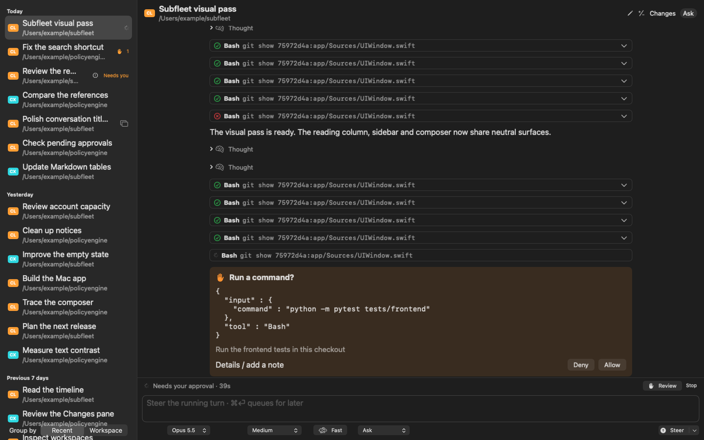
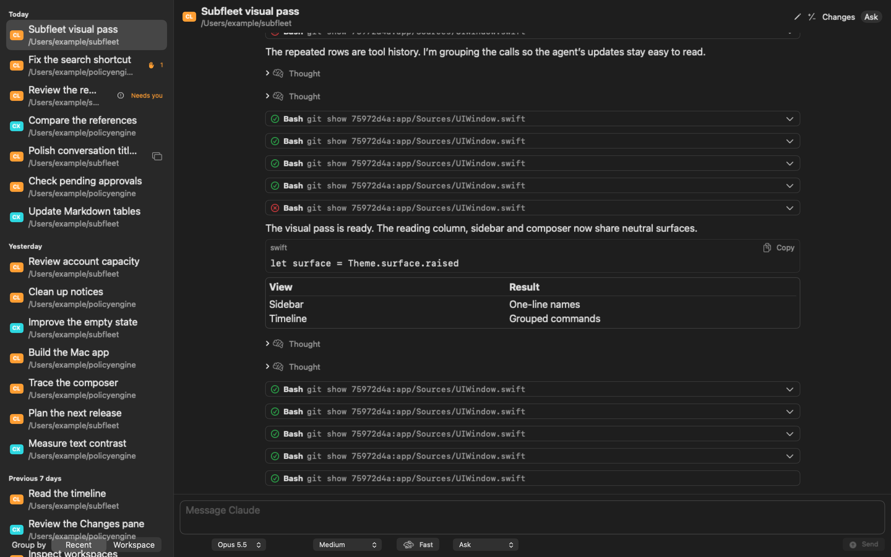
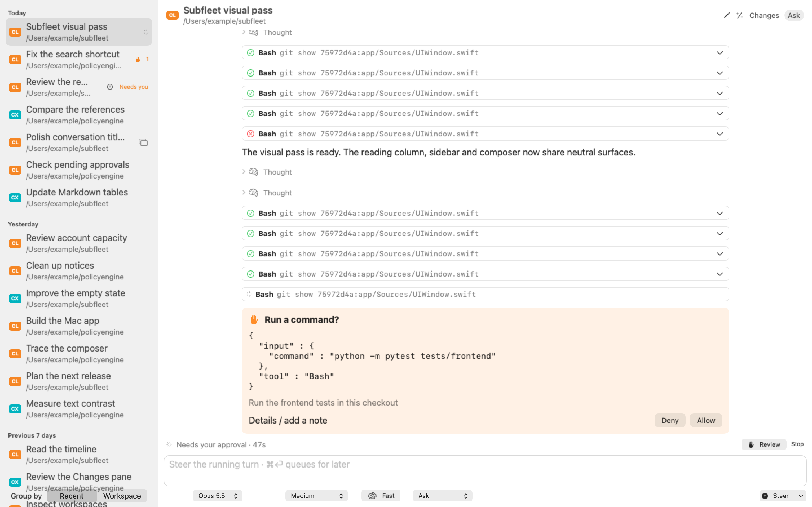
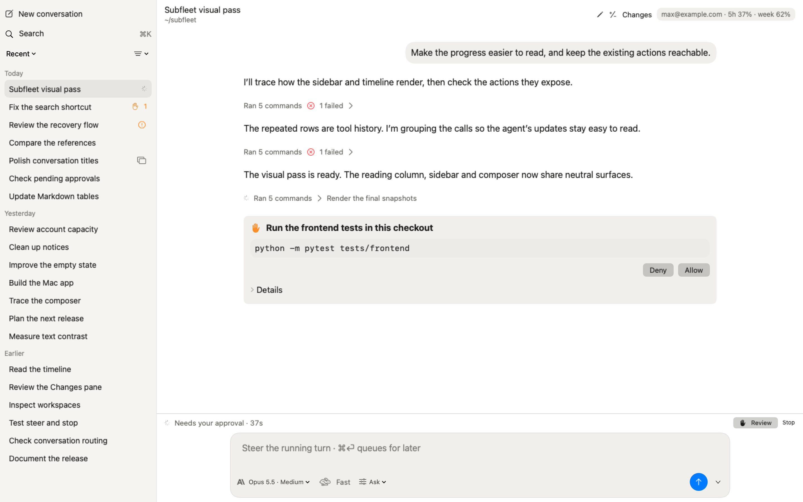
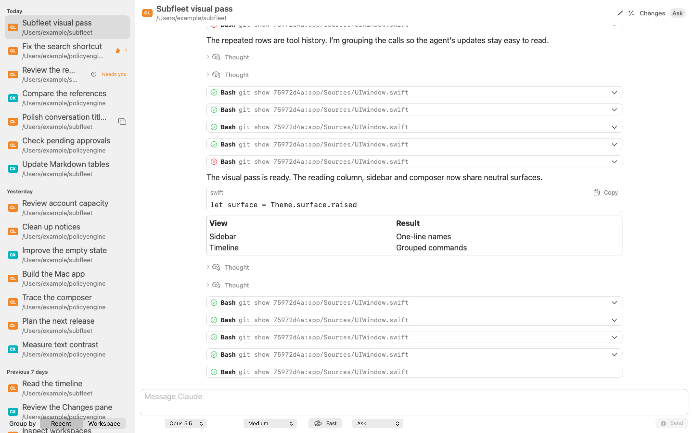
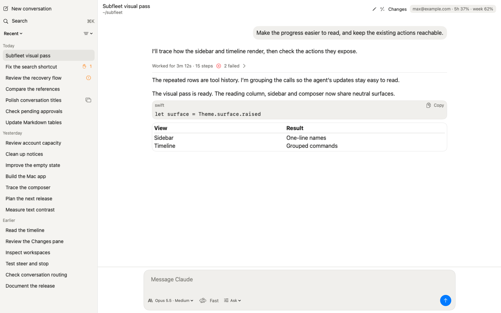

# Subfleet visual pass

The [release-owner follow-up](REVIEW.md) records the latest approval/question, receipt, header and Rename corrections. All after images below now use that revision; the original baseline images and initial validation results remain preserved.

The agent's prose carries live progress. Consecutive tools and visible thinking summaries fold into one quiet expandable row between messages. Empty thinking disappears. Finished turns collect their entire tool history into one duration-and-count row. Raw input and output remain available inside each expanded tool.

The release-owner overrides take precedence for ledger rows 6, 7 and 16: sidebar names occupy one line in either grouping, paths remain in tooltips and the header, and provider marks appear beside the composer model name only. The native-session circular arrow meant “existing session; opening continues it here”; it was removed as provenance rather than current state. Approval/blocked, running, open-elsewhere and non-continuable states keep distinct named marks and tooltips.

The snapshot fixture is a frozen, sanitized record assembled in the daemon's public event format: 15 Bash starts, six thinking blocks (four empty), three agent text messages, two failed tools and one running tool. It is a test replay rather than a capture from a live account; its [provenance](../../../tests/fixtures/visual/README.md) is documented. The finished replay settles the last call and turn at 3m 12s. Both versions use the same event fixture and real app views. No account, installed app, daemon or live Application Support directory participates.

| Live before | Live after |
| --- | --- |
|  |  |

| Finished before | Finished after |
| --- | --- |
|  |  |

| Live before (light) | Live after (light) |
| --- | --- |
|  |  |

| Finished before (light) | Finished after (light) |
| --- | --- |
|  |  |

## Snapshots

Each image renders the real views at 1440×900 points and 2880×1800 pixels. An unshown offscreen AppKit backing context supports Lists and native text editors; no window is ordered on screen. Fixture storage and preferences are isolated. `tools/app_snapshots.sh <outdir>` reproduces them; use the foreground verification wrapper described in `docs/reports/2026-10-03-app-cutover.md` on PATH for sandboxed compilation.

| Scene | Dark | Light |
| --- | --- | --- |
| Sidebar: 20 names, three date groups, running/needs-you/blocked | [dark](after/sidebar-dark.png) | [light](after/sidebar-light.png) |
| Finished work, Markdown code/table, person bubble | [dark](after/finished-dark.png) | [light](after/finished-light.png) |
| Live work and pending approval | [dark](after/live-dark.png) | [light](after/live-light.png) |
| Expanded live work: description labels and thinking summaries | [dark](after/live-expanded-dark.png) | [light](after/live-expanded-light.png) |
| Blocked, Continue and Leave | [dark](after/blocked-dark.png) | [light](after/blocked-light.png) |
| New conversation | [dark](after/new-dark.png) | [light](after/new-light.png) |
| Refused folder | [dark](after/refused-dark.png) | [light](after/refused-light.png) |
| Widened permission: Bypass and confirmation | [dark](after/permission-dark.png) | [light](after/permission-light.png) |
| Empty state | [dark](after/empty-dark.png) | [light](after/empty-light.png) |

## Intentional differences and evidence

SF Pro remains the native Mac face because the reference faces are not licensed. The Mac accent remains on focus and Send because Subfleet routes across providers. At actual text size the retained reading column is 896 points, wider than the roughly 740-point reference; ledger row 9 explicitly retains the existing reading-column width. Subfleet retains its serving-account usage chip, per-turn serving facts in finished-work tooltips, approval/question forms, steer and stop controls, Changes, and explicit Continue/Leave recovery actions because they express its routing and review workflow.

The new-conversation scene renders the app’s actual draft view in its existing detail-pane placement; changing it to a modal sheet would change navigation behavior. Native buttons in the offscreen, inactive AppKit context can appear gray. The baseline material uses an opaque native backing because there is no visible desktop to blur. The out-of-scope menu-bar popover, Changes rendering and ⌘K palette keep their existing layouts, with colors and radii moved to tokens.

No official vector artwork existed in the checkout. `ProviderMark.swift` draws faithful simplified monochrome template outlines of Anthropic's geometric mark and OpenAI's Blossom, with arcs sampled into short segments. Silhouette templates came from Simple Icons (Anthropic current, OpenAI 15.0.0, CC0); the marks belong to their respective companies. [OpenAI's brand reference](https://openai.com/brand/) identifies the Blossom. These are small secondary-colored provider identifiers, not Subfleet branding.

The spec's original tertiary colors fail its 3:1 requirement on selected rows. The final tertiary pair is dark `#8B8A86`, light `#777670`; all other RGB surface/text pairs match the spec. Minimum contrast over all five surfaces and both modes: primary 10.609:1, secondary 4.950:1, tertiary 3.614:1. The Swift test computes the ratios directly from production tokens.

The header reads serving facts already returned by `conversation.open` receipts/events, and matches them to the existing status snapshot. Five-hour and weekly usage use the same stale/mismatch checks as the quota panel. If a lane's current account differs from the recorded serving account, the chip retains the recorded name and withholds the unrelated usage. A dash means unavailable usage; no daemon fields or protocol changes were needed.

The existing public stream bounds scrubbed tool inputs to 500 characters. A description or filename is used when present; older or truncated records fall back to a plain verb. The raw public input stays inside the tool expansion. Full daemon inputs are not available to the view.

## Ledger

Source links below use repository-relative paths and name the production views, rather than the snapshot harness.

| Row | Result and source |
| --- | --- |
| 1 — Surfaces | Opaque dynamic neutral surfaces, replacing window/sidebar material: `app/Sources/Theme.swift:9`, `app/Sources/UIWindow.swift:65`, `:215`. |
| 2 — Color | Neutral person bubble and chips; color denotes state. Provider badges removed: `app/Sources/UIWindow.swift:219`, `app/Sources/Theme.swift:71`. |
| 3 — Typeface | SF Pro and existing reading/text-scale behavior retained intentionally: `app/Sources/TextScale.swift:77`, `app/Sources/UIReading.swift:44`. Navigation and controls now use specified sizes: `app/Sources/Theme.swift:89`. |
| 4 — Accent | Mac accent for Send and visible focus: `app/Sources/Theme.swift:80`, `app/Sources/UIComposer.swift:271`; native editor focus outline in `app/Sources/UIComposer.swift:33`. |
| 5 — Sidebar top | New conversation first, Search second, connected to the existing ⌘K palette: `app/Sources/UIWindow.swift:154`. |
| 6 — Sidebar rows | One-line names in both groupings, 32-point pitch, 14-point type, rounded selection; folder tooltip and named state marks: `app/Sources/UIWindow.swift:199`, `:219`. Release-owner override applied. |
| 7 — Provider | No row badge. Simplified monochrome template provider marks beside the composer model: `app/Sources/ProviderMark.swift:347`, `app/Sources/UIModelControls.swift:15`, `app/Sources/UIWindow.swift:471`. |
| 8 — Grouping | Quiet list-header switch; Today/Yesterday/Earlier headings, or existing workspace headings: `app/Sources/UIWindow.swift:146`, `:170`. |
| 9 — Column | Centered existing reading column, 24-point padding: `app/Sources/UIWindow.swift:305`, `app/Sources/TextScale.swift:116`. |
| 10 — Person | Right-aligned neutral raised bubble, radius 16: `app/Sources/UIWindow.swift:548`. |
| 11 — Work | Live prose remains visible; intervening calls group quietly. Finished history becomes one duration/count line: `app/Sources/WorkPresentation.swift:64`, `app/Sources/UIWindow.swift:992`, `app/Sources/Timeline.swift:583`. |
| 12 — Steps | Borderless secondary monospace description/filename labels and named status; raw input/output only inside expansion. Empty thinking omitted; visible summaries inside group details: `app/Sources/WorkPresentation.swift:7`, `app/Sources/UIWindow.swift:1040`. |
| 13 — Composer | One raised radius-16 container, controls inside, round Send/Steer: `app/Sources/UIComposer.swift:160`, `:281`. |
| 14 — Model/effort | One menu with existing model and effort choices and catalog display names: `app/Sources/UIModelControls.swift:15`. |
| 15 — Permission | Quiet menu, amber when widened; existing confirmation retained: `app/Sources/UIModelControls.swift:57`, `app/Sources/UIComposer.swift:222`. |
| 16 — Header | Regular 15-point title, folder, Changes and serving chip: `app/Sources/UIWindow.swift:446`. |
| 17 — Serving account | Existing serving facts matched to existing status usage, with stale/unmatched values withheld: `app/Sources/AccountUsage.swift:3`, `app/Sources/UIModel.swift:352`. |
| 18 — Notices | Shared neutral notice style for limits, failures and app availability; failed-send footer remains a recovery button: `app/Sources/Theme.swift:125`, `app/Sources/UIWindow.swift:38`, `:520`, `app/Sources/UIFailedConversationDraft.swift:13`. |
| 19 — Injected turns | Existing typed notice parsing already correct; notice rendering now uses the shared style: `app/Sources/UIWindow.swift:523`. |
| 20 — Blocked | Same Continue/Leave actions in a neutral notice with separate visible controls: `app/Sources/UIConversationRecovery.swift:6`. |
| 21 — Radii | Three role tokens replace numeric view radii: `app/Sources/Theme.swift:23`. |

## Initial validation

The full run of `tests/frontend` and `tests/unit/test_app_cutover_daemon.py` passed **340 tests**, with **one skip** (341 collected: 328 frontend, 13 app). Frontend: 327 passed, one skipped. App daemon regressions: 13 passed. This includes the four new contrast/progress/account tests. The skipped native process check needs sandbox-unavailable `ps`/sysctl boot identity. [JUnit results](tests.xml) preserve the exact cases. Wall time: 3822.75 seconds.

After the native color, monospace step and last token fixes, the real reading/menu views passed **13 tests** in 631.57 seconds. [View results](view-tests.xml) cover text scale, palette keys/modality/layout, menu layout/reload and Changes row geometry. The final permission label uses an image interpolated into Text because AppKit ignores foreground color on a Menu’s Label. Its options and selection/confirmation handlers remain unchanged.

The final native permission label passed the five real reading/keyboard/palette tests again in **113.64 seconds** ([final view results](final-view-tests.xml)). The existing choice is still called “Bypass”; only its styling changed. The real widened-permission scene confirms amber text and the existing explicit confirmation.

All **18 after images** and **four baseline images** were personally inspected against the references. The live scene shows three unfurled prose messages separated by three groups of five commands, with two failures and a named running spinner. Its expansion shows the two visible thinking summaries and borderless human-labelled tools. The finished scene shows one duration/count/failure row, all three prose messages, Markdown code/table and the person bubble. Sidebar rows have no paths or badges, and every state mark has a tooltip. Both refused-folder scenes show the reason, a scratch-folder action and disabled Start controls. Both new-draft scenes show a complete focus outline. Blocked scenes expose Continue/Leave, and empty scenes retain New conversation and ⌘K guidance. The initial inspection covered 22 PNGs; the updated [snapshot manifest](snapshots.json) verifies 28 PNGs (20 reviewed renders and eight comparison images) at exactly 2880×1800 pixels; the renderer asserts that no window was visible.

The color/radius/material audit finds no inline blue/orange, opacity fills, numeric radii or window materials outside Theme. The sole `.opacity(0)` is the pre-existing invisible ⌘= shortcut button, not a fill; it stays to preserve text-size behavior.

`app/build.sh "$PWD/build/visual-pass-product"` succeeded in **349.16 seconds** through the foreground resumable compiler route (15-minute frontend allowance). `codesign --verify --deep --strict build/visual-pass-product/Subfleet.app` passed. The app was not installed or launched. Existing Swift concurrency/unnecessary-await warnings and the verification wrapper’s unused library-search-path warning remain. No protocol, daemon, routing or policy files changed.

Controls retain their labels, keyboard actions and focus. The editor has a visible Mac-accent outline; quiet buttons retain hover and focus outlines. State also uses named words or glyphs, including failed counts, approval hands, blocked octagons, locks and open-elsewhere windows. Existing regression coverage exercises approvals/questions, steer/stop, recovery actions, ⌘K, text size and Changes.

Every yielded test, compiler, snapshot and build session was awaited. The exact-PID compiler record has a completion for every start and no active children. No background or detached job was created by this work; no installed app, live daemon or live app support directory was used.

Reproduction (with the verification wrapper on PATH):

```sh
.venv/bin/python -m pytest -p tools.app_cutover_pytest tests/frontend tests/unit/test_app_cutover_daemon.py -q
tools/app_snapshots.sh docs/reports/2026-10-03-visual-pass/after
app/build.sh "$PWD/build/visual-pass-product"
codesign --verify --deep --strict build/visual-pass-product/Subfleet.app
```

The baseline source comes from `git archive 75972d4a app/Sources`, extracted under the ignored `build/visual-baseline/Sources`. Render it with `SF_SNAPSHOT_SOURCE_ROOT="$PWD/build/visual-baseline/Sources" SF_SNAPSHOT_SCENES=live,finished tools/app_snapshots.sh docs/reports/2026-10-03-visual-pass/before`.

## Initial delivery

The shared git metadata is outside the writable workspace. Coherent commits therefore live on **`feat/visual-pass`** in the ignored workspace-local **`.git-local`**, based on **`75972d4a9506132ac066c2e7474d5a1b9ac20f10`**. Implementation and renderer head: **`ccacf66`**; the final evidence commit adds this report, PNGs, fixture provenance, manifest and JUnit results. Every commit carries the requested coauthor.

The requested bundle is **`docs/reports/2026-10-03-visual-pass.bundle`**, with head **`refs/heads/feat/visual-pass`** and prerequisite **`75972d4a`**. Its final hash is returned in the delivery message. The binary bundle remains a separate workspace artifact, outside the committed report. Nothing was pushed.
