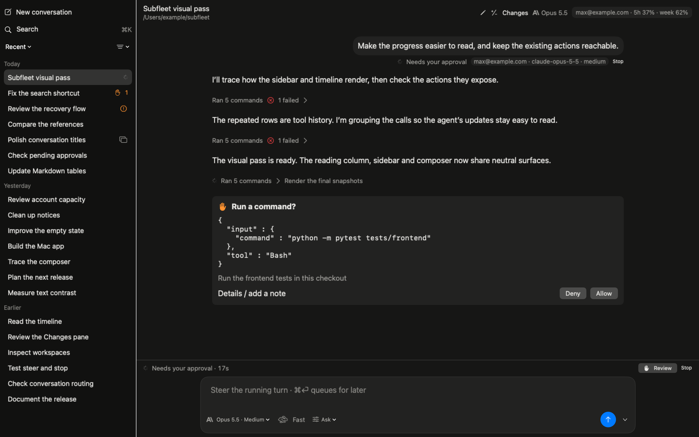
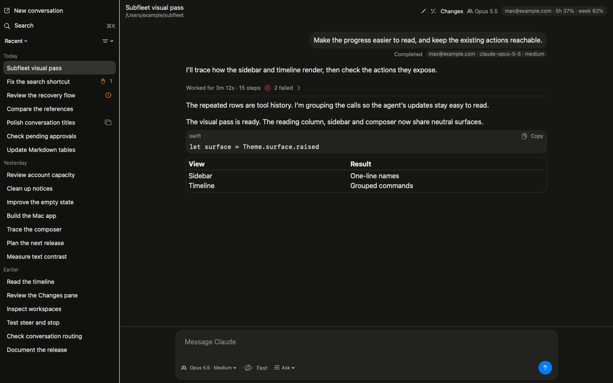
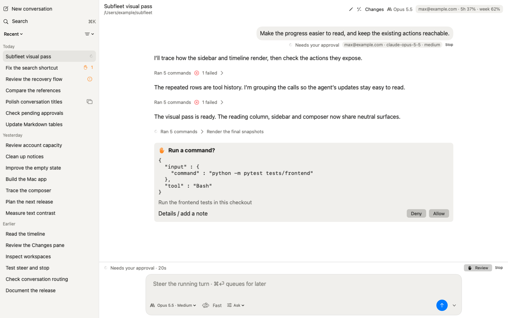

# Release-owner snapshot review

The REQUEST CHANGES findings on `b6c5e9af` are addressed in the [review-fix report](../2026-10-04-visual-review-fixes/README.md), with new regression and mutation evidence and all scenes rendered again. That report supersedes the presentation decisions and renders below.

The four requested display corrections retain the original prose/tool grouping, name-only sidebar, composer container and finished-work summary.

1. Approval cards lead with the description, show the command in one selectable monospace block, and retain Deny/Allow. Full request JSON and the note action are behind **Details**. Question cards show their description, question and choices normally; full request JSON is also behind **Details**. The review sheet follows the same presentation. Commands use the person-only masked request when available, rather than replacing it with provider input. Masked-value review, nonce/hash validation and response handlers are unchanged.
2. Running turns use the pinned bottom status strip, including Review and Stop. Ordinary completed turns have no visible receipt line. The finished **Worked for** row's tooltip contains the serving account/model/effort and any existing serving warnings. Sending, unresolved-delivery, queued and steered acknowledgments and per-turn Changes remain reachable.
3. The header contains the title, home-abbreviated folder, Rename, Changes and the account-usage chip. Model/provider appears only in the composer control. The duplicate model hint below the new-conversation composer was removed as well. The existing `abbreviatedPath` already handles the home directory correctly; the updated conversation fixtures exercise `~/subfleet`.
4. Kept the pencil: its tooltip and accessibility label both say **Rename**. The title's existing context-menu Rename action remains available.

The renderer replays the same frozen progress fixture. The additional question scene exercises the real question card and its Details control without changing the stream fixture or contacting a daemon. All snapshots remain 1440×900 points at 2×, in both modes, with no visible window.

| Reviewed render | Updated render |
| --- | --- |
|  |  |
|  |  |
|  |  |
|  |  |

| Scene | Dark | Light |
| --- | --- | --- |
| Sidebar | [dark](after/sidebar-dark.png) | [light](after/sidebar-light.png) |
| Finished | [dark](after/finished-dark.png) | [light](after/finished-light.png) |
| Live approval | [dark](after/live-dark.png) | [light](after/live-light.png) |
| Expanded live work | [dark](after/live-expanded-dark.png) | [light](after/live-expanded-light.png) |
| Blocked | [dark](after/blocked-dark.png) | [light](after/blocked-light.png) |
| New conversation | [dark](after/new-dark.png) | [light](after/new-light.png) |
| Refused folder | [dark](after/refused-dark.png) | [light](after/refused-light.png) |
| Widened permission | [dark](after/permission-dark.png) | [light](after/permission-light.png) |
| Empty | [dark](after/empty-dark.png) | [light](after/empty-light.png) |
| Question | [dark](after/question-dark.png) | [light](after/question-light.png) |

The [initial report](README.md) retains the original baseline comparison and initial full-suite validation. Its after images now point to these reviewed renders. The original baseline images remain unchanged.

The targeted regression run passed **91 tests** in **835.68 seconds**, including approval reachability, masked requests, question drafting, notifications, native reading/menu views, keyboard behavior and all 13 app daemon regressions. Generated run evidence was removed in round four; the test sources remain committed. The initial full-suite results remain in the original report.

The final presentation checks passed **5 tests** in **100.90 seconds**, including contrast, unchanged progress grouping, finished-work collapse, account matching, masked-command precedence, tooltip facts and queued/steered/unresolved acknowledgment states. These five cases overlap the regression run; they are not 96 distinct tests.

Source: cards in `app/Sources/UIApprovals.swift:18` and `ApprovalPresentation.swift:4`; live/finished metadata in `UIWindow.swift:297`, `:570`, `:1008` and `WorkPresentation.swift:112`; header and Rename in `UIWindow.swift:449` and `:466`; duplicate draft hint removed at `UINewConversation.swift:92`.

All **20 final renders** were personally inspected in both modes. Rendering took **312.90 seconds** from source `b51bdcea06b68da3d53787ee0458e3b9d6bda5f6`. The unused run manifest was removed in round four; snapshot tests validate dimensions and scene coverage directly. The cards, single live status strip, header folder/model placement, Rename label, refused-folder focus and Continue/Leave controls were checked visually.

Remaining reference differences are unchanged: native SF Pro typography, the 896-point reading column, the Mac accent color, Subfleet's account/review/workspace controls, and gray inactive controls in offscreen AppKit renders. Provider marks remain the simplified vectors documented in the initial report.

`app/build.sh build/visual-pass-product` succeeded in **502.26 seconds** through the resumable compiler route. `codesign --verify --deep --strict` passed. The compiler emitted a Swift concurrency warning and the linker warned about the wrapper's missing Swift search directory; neither prevented a successful build or signature check. The app was neither installed nor launched.

Implementation commits are `80a01c8` and `b51bdce`; the final evidence commit adds this report and the reviewed snapshots. Commits are on `feat/visual-pass` in workspace-local `.git-local`, with the required coauthor trailer. The verified delivery bundle is `docs/reports/2026-10-04-visual-review.bundle`, head `refs/heads/feat/visual-pass`, with prerequisite **`a65ee8ea1238883bea0c6a72de54261253e894c7`**. Its exact final head is reported in the delivery message. The original bundle is preserved.

All foreground commands and their compiler children completed. No protocol, daemon, routing or policy files changed; no live state was touched and nothing was pushed.
